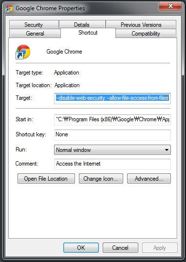
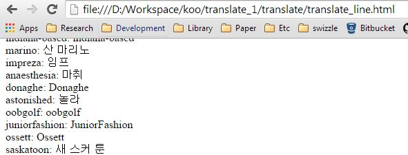

한글 번역기 자동화
===========

## 구글 번역 자동화

* 방식 : html file 로 json 요청하기
* 사전 준비사항 
> 구글 크롬으로 Html 파일 실행하는데, 구글 크롬 옵션 셋팅해야함.
> 
>> 
>
>  Target 항목에 옵션 추가 : --disable-web-security --allow-file-access-from-files

* html 파일 실행 방법
> html 파일을 크롬 브라우저로 실행
>> 

* html 파일의 종류
> ### 기본 단어형 번역하기 [translate/translate.html](translate/translate.html)
>
> 번역 파일 기본 형태 : 줄바꿈으로 연결된 단어 리스트 파일
>
>> Business
>
>> Aerospace_and_Defense
>
>> Aeronautical
>
>> Aircraft_and_Components
> 
> ### 셈플텍스트 포함 단어 번역하기 [translate/translate_line.html](translate/translate_line.html)
>
> 샘플 텍스트가 포함된 단어 (##)을 구분자로 사용
>
>> slavin ## Slavin, Arlene - Presents her paintings, drawings, sculptures, and public art. Includes resume and review article.
>
>> shortlines ## Shortlines of Chicago Historical Society - Railroad historical society that is preserving information about 
>
>> hypercombofinish ## Hypercombofinish - Home of gaming enthusiast Chris Maguire. Also features reviews and satirical articles
>
>> doowop ## Whirlin Disc Records - Specializing in oldies, doowop and country music on 45 LPs, cassette and CDs, mail order
> 

## 네이버 번역 자동화 

* 방식 : python web parsing program
* 네이버 번역은 google 번역작업 후에 나온 결과로만 돌리기 가능.
* Option 으로 Google을 Naver로 대체하거나 Google로 번역 안된 부분만 Naver로 할지 선택 가능

> ### 네이버 번역 자동화 [translate/translate_naver.py](translate/translate_naver.py)
>
> 소스파일 형태 원본단어' '번역단어
>
>> Acting: 연기
>
>> Actors_and_Actresses: 배우
>
>> Libraries: 도서관
>
>> Library_and_Information_Science: 도서관 및 정보 과학
>
>> Number_Theory: 번호 이론

## ODP title, description 가져오기 

* 방식 : python web parsing program
* 카테고리 여러개도 상관없음.

> ### ODP 데이터 가져오기 [translate/dmoz_search.py](translate/dmoz_search.py)
>
> 소스파일 형태 단어' '카테고리' '...
>
>> timed Top/Sports/Equestrian Top/Kids_and_Teens/School_Time
>
>> e-prime Top/Science/Social_Sciences/Linguistics/Languages
>
>> noxzema Top/Business/Consumer_Goods_and_Services/Beauty
>
>> kimminau Top/Business/Information_Technology
>
>> clickerpaps Top/Recreation/Pets/Dogs/Breeds/Toy_Group

## 번역 개수 체크

* 방식 : python program
* google 번역된 파일의 번역된 단어 개수를 출력

> ## 번역 개수 체크 [translate/check_translated.py](translate/check_translated.py)
>
>> google 로 나온 번역 결과 활용.
>
